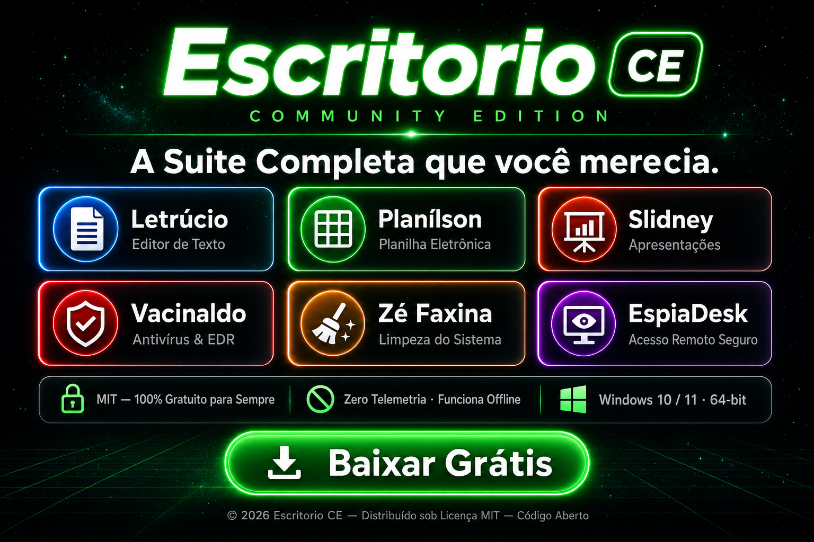

[](https://github.com/edivanccastro/escritorio/releases/latest)

<div align="center">

[](https://github.com/edivanccastro/escritorio/releases/latest)

</div>

# Escritorio CE — Community Edition

> **Produtividade Completa para o Escritório** — suíte open source em C# (.NET 8 + WPF) com 6 aplicativos independentes, instalador profissional e identidade visual própria.

[](LICENSE)
[](https://dotnet.microsoft.com)
[](https://www.microsoft.com/windows)

---

## Aplicativos

| App | Função | Cor |
|-----|--------|-----|
| **Letrúcio** | Editor de textos com ribbon e estilos | Azul |
| **Planílson** | Planilhas com fórmulas e formatação | Verde |
| **Slidney** | Apresentações de slides com temas | Laranja |
| **Vacinaldo** | Antivírus + EDR comportamental | Vermelho |
| **Zé Faxina** | Limpeza e otimização do sistema | Amarelo |
| **EspiaDesk** | Acesso remoto seguro (AES-256 + RSA 2048) | Roxo |

Cada aplicativo possui executável próprio, ícone exclusivo e interface com faixa de opções (ribbon) em estilo profissional.

---

## Recursos por Aplicativo

### Letrúcio — Editor de Textos
- Ribbon completo: Arquivo, Início, Inserir, Layout, Revisão e Exibir
- Formatação rica: negrito, itálico, sublinhado, tachado, subscrito, sobrescrito, cor e realce
- Parágrafos: marcadores, numeração, recuo, alinhamentos e espaçamento entre linhas
- Estilos (Normal, Título 1, Título 2), Localizar e Substituir, verificação ortográfica
- Inserir tabela, imagem, símbolos, data/hora e quebra de página
- Salva/abre: `.docx`, `.odt`, `.rtf`, `.txt`

### Planílson — Planilhas
- Formatação de células: alinhamento, formatos de número (moeda, percentual, milhar)
- Inserir/excluir linhas e colunas, classificar crescente/decrescente
- Fórmulas com intervalos: `=SOMA`, `=MÉDIA`, `=MÁXIMO`, `=MÍNIMO`, `=CONT`
- Salva/abre: `.xlsx`, `.ods`, `.csv`

### Slidney — Apresentações
- Slides: novo, duplicar, excluir e reordenar
- Layouts: Título e Conteúdo, Só Título, Em Branco
- Temas de cor, modo apresentação em tela cheia
- Salva/abre: `.pptx`, `.odp`, `.json`

### Vacinaldo — Antivírus + EDR
- Varredura de arquivos com banco de assinaturas próprio
- Motor EDR comportamental com classificação de técnicas de ataque
- Relatório EDR detalhado por categoria de ameaça
- Proteção em tempo real e agendamento de varredura

### Zé Faxina — Limpeza do Sistema
- Remoção de arquivos temp, cache de sistema, cache de navegadores
- Limpeza de registro e arquivos de log
- Desinstalador de programas e gerenciador de inicialização
- Relatório de espaço liberado

### EspiaDesk — Acesso Remoto
- Conexão remota com ID numérico de 9 dígitos
- Criptografia ponta-a-ponta: RSA 2048 (troca de chaves) + AES-256 (sessão)
- Captura de tela via GDI+, controle remoto de mouse e teclado
- Chat integrado durante a sessão remota
- Sem servidor de retransmissão externo

---

## Formatos de Arquivo

| App | Microsoft Office | LibreOffice | Outros |
|-----|-----------------|-------------|--------|
| Letrúcio | Word `.docx` | Writer `.odt` | `.rtf`, `.txt` |
| Planílson | Excel `.xlsx` | Calc `.ods` | `.csv` |
| Slidney | PowerPoint `.pptx` | Impress `.odp` | `.json` |

A leitura/gravação de OOXML usa o **Open XML SDK (MIT)**; os formatos OpenDocument usam implementação própria (pacote ZIP + `content.xml`).

---

## Estrutura do Projeto

```
escritorio.sln
src/
  Escritorio.Shared/     Tema ribbon, motor de fórmulas, formatos OOXML/ODF
  Letrucio/              Editor de textos (azul)
  Planilson/             Planilhas (verde)
  Slidney/               Apresentações (laranja)
  Vacinaldo/             Antivírus + EDR (vermelho)
  ZeFaxina/              Limpeza do sistema (amarelo)
  EspiaDesk/             Acesso remoto seguro (roxo)
tools/
  IconGen/               Gerador de ícones .ico
  FaxinaIconGen/         Ícone do Zé Faxina
  VacinaldoIconGen/      Ícone do Vacinaldo
  gen-icon/              Ícone do EspiaDesk
  FormatTest/            Teste de ida e volta dos formatos
installer/
  escritorio.iss         Script do instalador (Inno Setup)
site/
  index.html             Site de apresentação da suíte
build-installer.ps1      Publica os apps e gera o instalador
flyer.jpg                Flyer de apresentação profissional
THIRD-PARTY-NOTICES.txt  Atribuições de licenças de terceiros
```

---

## Requisitos

- **Windows 10/11** (x64)
- **.NET SDK 8.0** — [download](https://dotnet.microsoft.com/download/dotnet/8.0)
- *(Opcional — instalador)* Inno Setup 6+ com `iscc.exe` no `PATH`
- *(Opcional — assinatura)* Windows SDK (`signtool.exe`) e certificado `.pfx`

---

## Executar em Desenvolvimento

```powershell
dotnet run --project .\src\Letrucio\Letrucio.csproj
dotnet run --project .\src\Planilson\Planilson.csproj
dotnet run --project .\src\Slidney\Slidney.csproj
dotnet run --project .\src\Vacinaldo\Vacinaldo.csproj
dotnet run --project .\src\ZeFaxina\ZeFaxina.csproj
dotnet run --project .\src\EspiaDesk\EspiaDesk.csproj
```

---

## Gerar o Instalador

O script publica todos os apps (self-contained, win-x64) e empacota em um único instalador com 5 perfis de instalação seletiva.

```powershell
.\build-installer.ps1 -Version "1.0.0"
```

Saída: `dist\installer\escritorio-setup.exe`

### Release Assinado

```powershell
.\build-installer.ps1 `
  -Version "1.0.0" `
  -CertPfxPath ".\certs\empresa.pfx" `
  -CertPassword "SUA_SENHA"
```

---

## Licença

Distribuído sob a licença **MIT** — consulte [LICENSE](LICENSE) para detalhes.

Dependências de terceiros e suas licenças estão listadas em [THIRD-PARTY-NOTICES.txt](THIRD-PARTY-NOTICES.txt).
